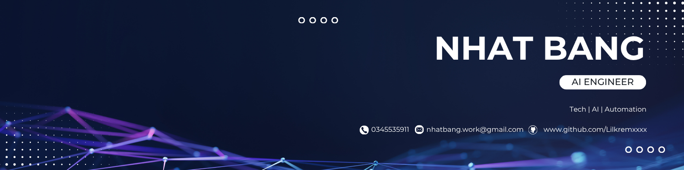

<!-- Minimal profile README with personal info and contribution snake -->

  

My name is Nguyễn Nhật Bằng, and I go by `nhatbangweb`  While I am just starting my professional career, I have been passionately learning how to build intelligent agents and automation systems.

I am currently an IT student and an **AI Engineering & Data Scientist Intern**, focusing heavily on building my skills in workflow automation, data infrastructure, and exploring AI-native solutions. I love tinkering with practical software and setting up self-hosted server architectures out of my own interest to continuously learn and grow.
 
If you're curious about how I organize things, I actually "vibed out" and built my own task management tool at [Taskin](https://taskmanage.pp.ua) for my personal daily use. You can also see more of my work on my [personal blog](https://lilkremxxxx.github.io/nhatbang/).

---

## Latest Blog Posts
<!-- BLOG-POST-LIST:START -->
- [Health Care](https://lilkremxxxx.github.io/nhatbang/)
<!-- BLOG-POST-LIST:END -->

---

## Statistics

  
  

<!-- GitHub Contribution Snake -->
<picture>
  <source media="(prefers-color-scheme: dark)" srcset="https://raw.githubusercontent.com/Lilkremxxxx/Lilkremxxxx/output/github-contribution-grid-snake-dark.svg" />
  <source media="(prefers-color-scheme: light)" srcset="https://raw.githubusercontent.com/Lilkremxxxx/Lilkremxxxx/output/github-contribution-grid-snake.svg" />
  
</picture>

---

## Let's Connect

## Skills & Expertise

<table>
  <tr>
    <td valign="top" width="50%">

**🎯 Leadership & Strategy**
 

 

**☁️ Cloud & Infrastructure**
 

</td>
<td valign="top" width="50%">

**💻 Languages & Frameworks**
 

 

**🤖 AI & Machine Learning & Deep Learning**
 

 

**🛠️ Other Tools**
 

 

**🛠️ Data Science & CV**
 

 

**🛠️ Databases & Automation**

 

</td>
</tr>
</table>

---

  <a href="https://youtu.be/UqNbBe3lVCI">🎥 How did I build this profile?</a>

